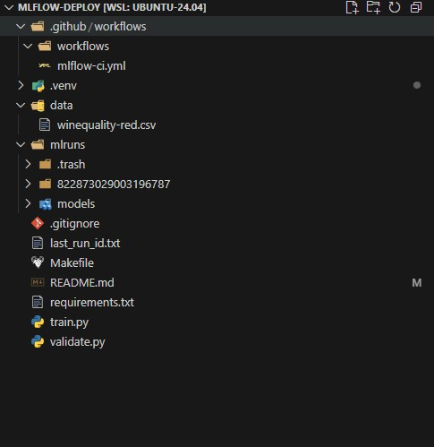
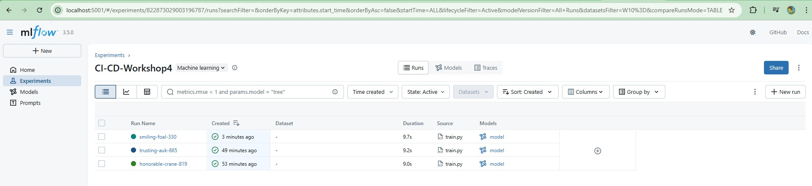
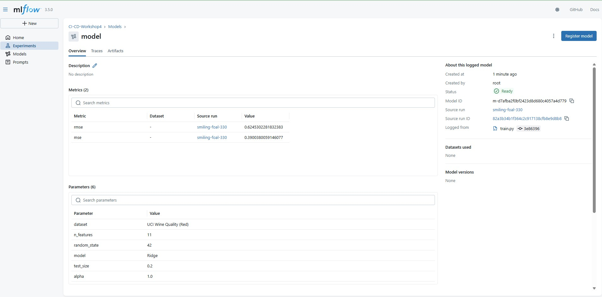
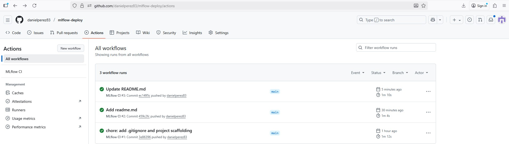

# Taller 4 — MLflow + GitHub Actions

## Presentado por
Laura Carolina Mateus Agudelo · Daniel Antonio Pérez Beltrán · Andrés Felipe Sainea Rojas

## Repositorio
https://github.com/danielperez83/mlflow-deploy

## ¿Qué hicimos?
Construimos un pipeline que **entrena**, **registra** y **valida** un modelo de ML, tanto **localmente** como en **GitHub Actions**.  
El resultado: con cada push/PR, el modelo se entrena, se guarda en **MLflow** (con **firma** e **input example**) y se **valida** con un **quality gate** automático.

## Estructura
```text
mlflow-deploy/
├── train.py
├── validate.py
├── requirements.txt
├── .github/
│   └── workflows/
│       └── mlflow-ci.yml
├── Makefile
└── mlruns/                 # se genera al entrenar; no se versiona
```


## Dataset externo
- **Wine Quality (Red)** — UCI (CSV con `;`).
- **Problema:** regresión (predecir `quality`).
- **Motivo:** público, pequeño y totalmente numérico (estable y rápido en CI).

## Entrenamiento y registro (MLflow)
- **Pipeline:** `StandardScaler` + `Ridge(alpha=1.0)`
- **Split reproducible:** `test_size=0.2`, `random_state=42`
- **MLflow** (tracking local `file://./mlruns`):
  - `log_params` (modelo, alpha, split, features)
  - `log_metrics` (`mse`, `rmse`)
  - `log_model` con **signature** e **input_example**
- Guardamos `last_run_id.txt` para que `validate.py` cargue el run correcto.




### Sobre `last_run_id.txt`
Durante el entrenamiento guardamos el `run_id` más reciente en `last_run_id.txt`.  
Luego, `validate.py` usa ese ID para cargar **el mismo** modelo con:

```runs:/<run_id>/model```

Esto garantiza que la validación se haga exactamente sobre el modelo recién registrado (no sobre uno antiguo).

### "Signature” y “Input example”
Al registrar el modelo con MLflow también guardamos:
- **Signature**: el esquema de entrada/salida (columnas y tipos) del modelo. Evita errores de compatibilidad al predecir.
- **Input example**: un ejemplo real de entrada (pequeño batch de datos) para probar e inspeccionar el modelo rápidamente.

## Validación (quality gate)
- Carga el modelo desde `runs:/<run_id>/model`.
- **Métrica:** `RMSE` en test.
- **Umbral:** `RMSE ≤ 0.85` → aprueba (exit `0`); si no, falla (exit `1`).

## CI con GitHub Actions
- **Workflow:** `.github/workflows/mlflow-ci.yml`
- **Pasos:** `install → train → validate` y publica **`mlruns`** como artefacto auditable.



## Cómo correrlo (local)
```bash
# crear y activar venv (Linux/WSL)
python3 -m venv .venv && source .venv/bin/activate

# instalar dependencias
make install

# entrenar y registrar en MLflow
make train

# validar (quality gate)
make validate

# abrir UI de MLflow
make mlflow-ui   # http://127.0.0.1:5001
